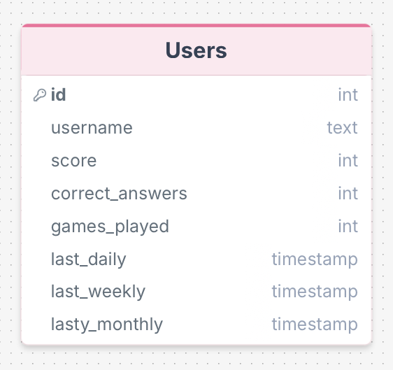
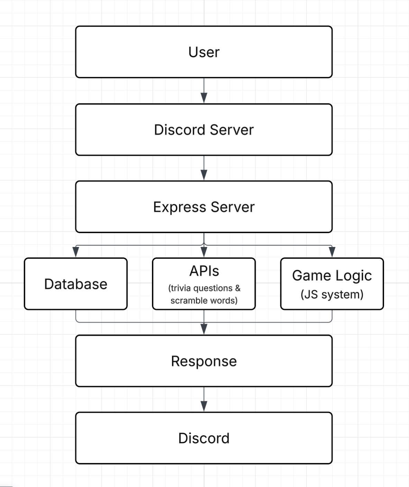
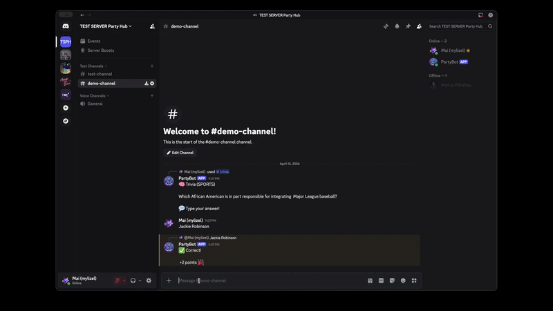

# Discord Party Bot — Final Report

## Project Summary
This project is a Discord Game Hub Bot that allows users to play multiple mini-games (trivia, word scramble, math, riddles, and rock-paper-scissors) directly in a server. It includes a scoring system, leaderboard, and reward mechanics to create an engaging and competitive experience.

---

## Diagrams

### ERD (Entity Relationship Diagram)

---

### System Design

---

## Demo

---

## What I Learned

1. How to integrate APIs into a backend system  
I learned how to fetch and use real-time data from external APIs (trivia and word generation) and incorporate it into a live application.

2. How to design a scalable backend system  
I structured my bot so that multiple games could run using a shared system (`activeGames`), making it easy to add new features.

3. Working with databases (PostgreSQL)  
I learned how to store and update user data such as scores, rewards, and cooldown timers using SQL queries.

4. Handling real-time user interaction  
Managing multiple users answering at once taught me about event-driven programming and concurrency.

---

## AI Integration

### Does your project integrate with AI?
No. While my current implementation uses APIs, the structure allows easy integration of AI-generated content if desired.

---

## How I Used AI to Build This Project

I used AI to:
- Debug errors (especially Discord and command issues)
- Refine code for new features
- Step-by-step on how to set up a Discord bot
 
---

## Why This Project Is Interesting to Me

I chose this project because I enjoy both gaming and building interactive systems. 
Turning a Discord server into a mini game platform felt like a fun and practical way to combine those interests. 
I also liked the challenge of making something that other people could actually use and enjoy together.

---

## System Considerations

### Failover Strategy
Currently minimal (single server setup). This could be improved with cloud hosting, multiple instances, and retry logic for API failures.

### Scaling
The system is designed with modular game logic, making it easy to add new games. It could scale further by splitting services and using load balancing.

### Performance
The bot uses lightweight operations (API calls and database queries). In-memory game state (`activeGames`) keeps responses fast.

### Authentication
The bot uses Discord’s interaction verification (`verifyKeyMiddleware`) to ensure requests are valid and secure.

### Concurrency
The bot handles multiple users through an event-driven system (`messageCreate`). Each channel has its own game state, preventing conflicts.f
