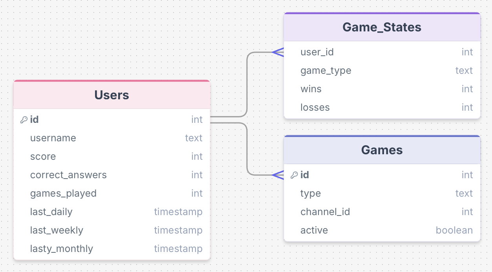

# Discord Party Bot — Initial Plan

## 1. Purpose & Goals
**Purpose:**  
This project is a Discord Game Hub Bot that allows users in a server to play multiple mini-games directly in chat. 
Instead of being a single-purpose bot, this bot creates a centralized gaming experience inside Discord.

**Goals:**  
- Create a fun, interactive experience inside Discord servers
- Support multiple mini-games
- Store user progress (scores, stats, rewards)
- Use APIs to generate dynamic content
- Build a scalable system that can easily add more games

## 2. Initial ERD (Entity Relationship Diagram)
Right now:
- Everything is stored in **Users**
- No seperate tables yet
  

**FUTURE ERD**
★ Users (1) → (Many) Game_Stats 
★ Users (1) → (Many) Games  

## 3. Rough System Design
**Overview:**  
- Discord bot interacts with users  
- Sports API provides game data  
- Database stores users, picks, and scores  
- Optional Redis cache for live data  
- Optional AI service for predictions  

★ Discord Bot → central piece, handles commands and messages  
★ Database → stores users, picks, scores  
★ Sports API → gets games, results  
★ AI Service → optional predictions or summaries  
★ Redis → optional cache for fast access

## 4. Initial Daily Goals (March 27 – End of Class)
| Date       | Goal |
|-----------|------|
| 3/27      | Draft project idea & sketches (completed) |
| 3/30      | Set up tech stack (bot repo, API keys, DB) |
| 3/31      | Fetch games from API & display in Discord |
| 4/2       | Implement pick command & store in DB |
| 4/6       | Add pick locking when game starts |
| 4/7       | Scoring system & leaderboard |
| 4/10      | Optional AI predictions / summaries |
| 4/13      | Polish, error handling, UX tweaks |

## 5. UX Sketch
