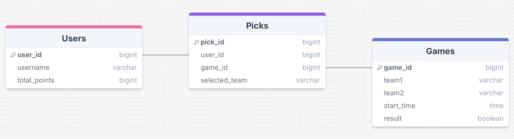
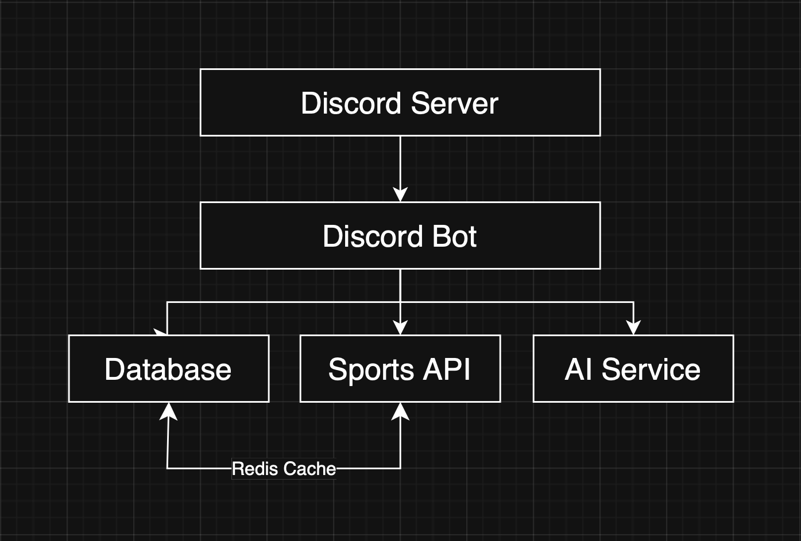

# Discord Sports Pick’em Bot — Initial Plan

## 1. Purpose & Goals
**Purpose:**  
Create a Discord bot that lets server members predict winners of sports games, earn points, and compete on a leaderboard. Think “ESPN Pick’em,” but built directly into Discord for a more social and interactive experience.

**Goals:**  
- Show current games from a sports API  
- Let users submit picks and automatically lock them when games start  
- Track scores and display a leaderboard  
- Add optional AI features for predictions or summaries  
- Make it fun and easy to use for sports fans  

  
*Placeholder for a picture or rough sketch showing how the bot works in Discord*

## 2. Initial ERD (Entity Relationship Diagram)
**Entities:**  
- **Users** (user_id, username, total_points)
- **Picks** (user_id, game_id, selected_team)
- **Games** (game_id, teams, start_time, result)
  
 

★ One user can have many picks (1:N)  
★ One game can have many picks (1:N)  

## 3. Rough System Design
**Overview:**  
- Discord bot interacts with users  
- Sports API provides game data  
- Database stores users, picks, and scores  
- Optional Redis cache for live data  
- Optional AI service for predictions  

 

★ Discord Bot → central piece, handles commands and messages  
★ Database → stores users, picks, scores  
★ Sports API → gets games, results  
★ AI Service → optional predictions or summaries  
★ Redis → optional cache for fast access
