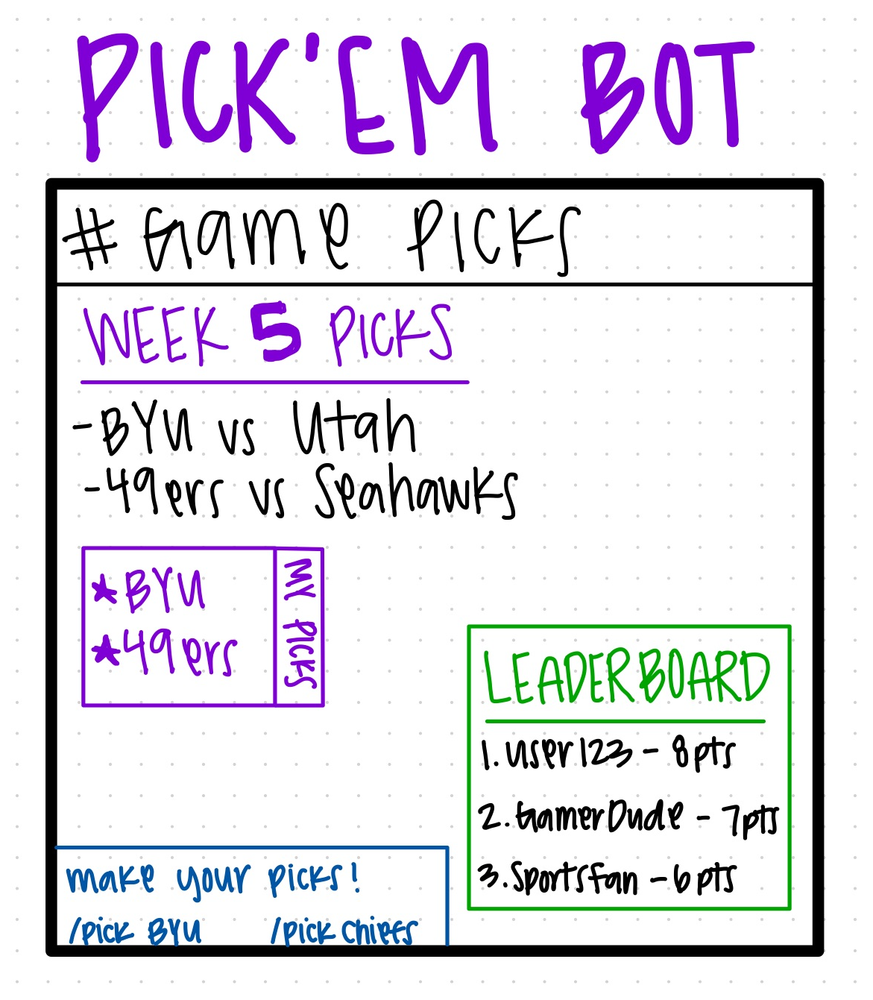

# Discord Party Bot — Initial Plan

## 1. Purpose & Goals
**Purpose:**  
Create a Discord bot that turns a server into a fun, interactive “party hub” where members can play mini-games, complete challenges, earn points, and compete on a leaderboard.

**Goals:**  
- Provide mini-games (trivia, guessing games, random challenges, etc.)
- Add daily, weekly, and monthly reward commands with cooldowns
- Let users earn and track points
- Maintain a leaderboard for competition
- Encourage social interaction and engagement in the server
- Add optional AI features for dynamic games, prompts, or trivia
- Make the bot easy, fun, and addictive to use 

## 2. Initial ERD (Entity Relationship Diagram)
- **Users** (user_id, username, total_points, last_daily, last_weekly, last_monthly)
- **Picks** (session_id, user_id, game_type, score, timestamp)
- **Games** (user_id, reward_type, claimed_at)
  

★ One user can have many game sessions (1:N)  
★ One user can claim many rewards over time (1:N)  

## 3. Rough System Design
**Overview:**  
- Discord bot interacts with users through commands
- Database stores users, points, cooldowns, and game results
- Game logic runs inside the bot (or via APIs for trivia, etc.)
- Optional Redis cache handles cooldown timers efficiently
- Optional AI service generates trivia, prompts, or dynamic game content 

★ Discord Bot → Handles commands, games, and user interaction  
★ Database → Stores users, scores, cooldowns, and game history  
★ Game Logic System → Runs mini-games and calculates points  
★ AI Service (optional) → Generates trivia, prompts, or smart responses  
★ Redis (optional) → Speeds up cooldown checks and temporary data  

## 4. Initial Daily Goals (March 27 – End of Class)
| Date       | Goal |
|-----------|------|
| 4/9     | Draft project idea & sketches |
| ??      | Set up tech stack (bot repo, API keys, DB) |
| ??      | Fetch games from API & display in Discord |
| ??       | Implement pick command & store in DB |
| ??       | Add pick locking when game starts |
| ??       | Scoring system & leaderboard |
| ??     | Optional AI predictions / summaries |
| ??     | Polish, error handling, UX tweaks |

## 5. UX Sketch

